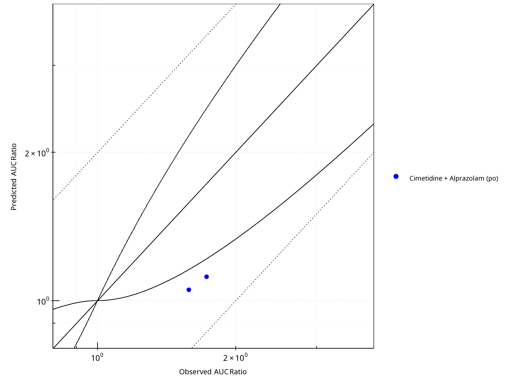
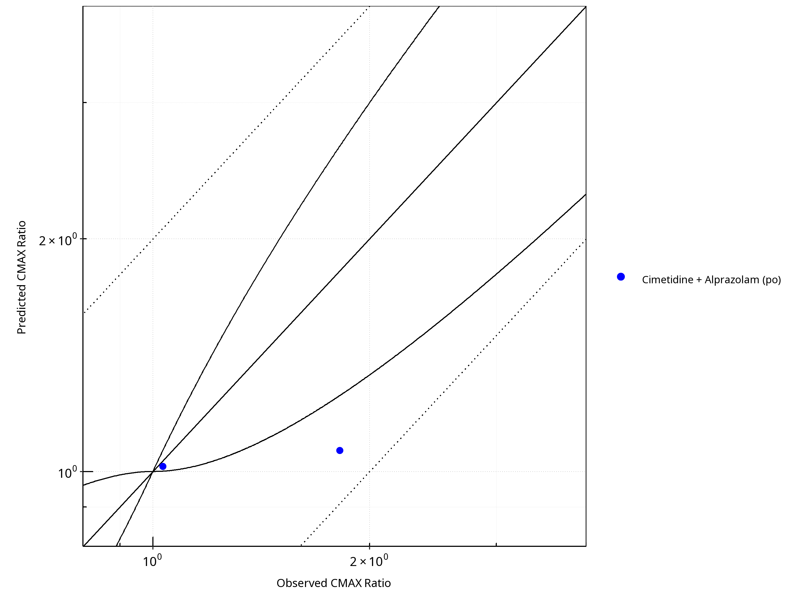
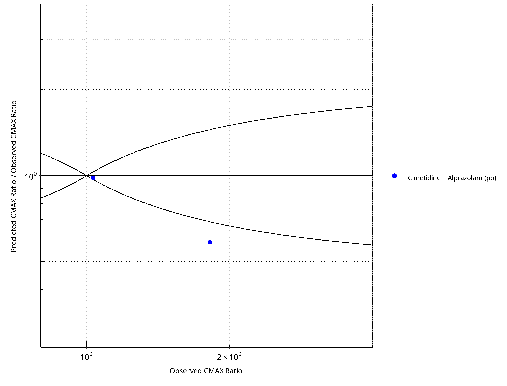
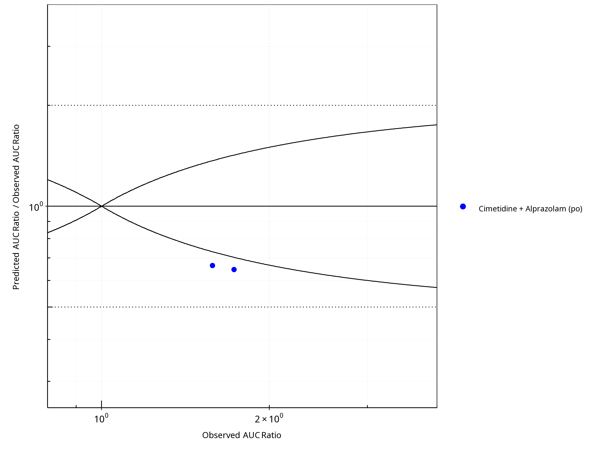

# CYP3A4 DDI Qualification

| Version                         | main-OSP12.3                                                   |
| ------------------------------- | ------------------------------------------------------------ |
| Qualification Plan Release      | [https://github.com/Open-Systems-Pharmacology/Qualification-DDI-CYP3A4/releases/tag/vmain](https://github.com/Open-Systems-Pharmacology/Qualification-DDI-CYP3A4/releases/tag/vmain) |
| OSP Version                     | 12.3                                                          |
| Qualification Framework Version | 3.7                                                          |

This qualification report is filed at:

[https://github.com/Open-Systems-Pharmacology/OSP-Qualification-Reports](https://github.com/Open-Systems-Pharmacology/OSP-Qualification-Reports)

# Table of Contents

 * [1 Qualification](#qualification)
   * [1.1 Mechanism](#qualification-ddi-subunit-9)
     * [1.1.1 Reversible Inhibition](#qualification-ddi-subunit-10)
   * [1.2 Perpetrator](#qualification-ddi-subunit-18)
     * [1.2.1 Cimetidine](#qualification-ddi-subunit-19)
   * [1.3 Victim](#qualification-ddi-subunit-27)
     * [1.3.1 Alprazolam](#qualification-ddi-subunit-28)

# 1 Qualification

**Figure 1-1: Plot.  Predicted vs. Observed AUC Ratio. (&delta; = 1 in Guest *et al.* formula)**

 
 

**Figure 1-2: Plot.  Predicted/Observed vs. Observed AUC Ratio. (&delta; = 1 in Guest *et al.* formula)**

 
 

**Figure 1-3: Plot.  Predicted vs. Observed CMAX Ratio. (&delta; = 1 in Guest *et al.* formula)**

 
 

**Figure 1-4: Plot.  Predicted/Observed vs. Observed CMAX Ratio. (&delta; = 1 in Guest *et al.* formula)**

 
 

**Table 1-1: GMFE for Plot Ratio**

|PK parameter |GMFE |
|:------------|:----|
|AUC          |1.52 |
|CMAX         |1.32 |

 
 

**Table 1-2: Summary table for Plot - AUC Ratio. (&delta; = 1 in Guest *et al.* formula)**

|AUC                          |Number |Ratio [%] |
|:----------------------------|:------|:---------|
|Points total                 |2      |-        |
|Points within Guest *et al.* |0      |0         |
|Points within 2 fold         |2      |100       |

 
 

**Table 1-3: Summary table for Plot - CMAX Ratio. (&delta; = 1 in Guest *et al.* formula)**

|CMAX                         |Number |Ratio [%] |
|:----------------------------|:------|:---------|
|Points total                 |2      |-        |
|Points within Guest *et al.* |1      |50        |
|Points within 2 fold         |2      |100       |

 
 

**Table 1-4: Summary table for Plot**

|DataID |Perpetrator                                                                  |Victim         |Predicted AUC Ratio |Observed AUC Ratio |Pred/Obs AUC Ratio |Predicted CMAX Ratio |Observed CMAX Ratio |Pred/Obs CMAX Ratio |Reference      |
|:------|:----------------------------------------------------------------------------|:--------------|:-------------------|:------------------|:------------------|:--------------------|:-------------------|:-------------------|:--------------|
|1332   |Cimetidine, 300 mg, PO, MD QID (1 day)                                       |Alprazolam, PO |1.05                |1.58               |0.67               |1.02                 |1.03                |0.98                |Abernethy 1983 |
|1340   |Cimetidine, 200/400 mg, PO, (200mg): MD TID (17 days); (400mg): OD (17 days) |Alprazolam, PO |1.12                |1.73               |0.65               |1.07                 |1.82                |0.59                |Pourbaix 1985  |

 
 

## 1.1 Mechanism

### 1.1.1 Reversible Inhibition

**Figure 1-5: Plot. Mechanism: Reversible Inhibition. Predicted vs. Observed AUC Ratio. (&delta; = 1 in Guest *et al.* formula)**

 
 

**Figure 1-6: Plot. Mechanism: Reversible Inhibition. Predicted/Observed vs. Observed AUC Ratio. (&delta; = 1 in Guest *et al.* formula)**

 
 

**Figure 1-7: Plot. Mechanism: Reversible Inhibition. Predicted vs. Observed CMAX Ratio. (&delta; = 1 in Guest *et al.* formula)**

 
 

**Figure 1-8: Plot. Mechanism: Reversible Inhibition. Predicted/Observed vs. Observed CMAX Ratio. (&delta; = 1 in Guest *et al.* formula)**

 
 

**Table 1-5: GMFE for Plot Ratio**

|PK parameter |GMFE |
|:------------|:----|
|AUC          |1.52 |
|CMAX         |1.32 |

 
 

**Table 1-6: Summary table for Plot - AUC Ratio. (&delta; = 1 in Guest *et al.* formula)**

|AUC                          |Number |Ratio [%] |
|:----------------------------|:------|:---------|
|Points total                 |2      |-        |
|Points within Guest *et al.* |0      |0         |
|Points within 2 fold         |2      |100       |

 
 

**Table 1-7: Summary table for Plot - CMAX Ratio. (&delta; = 1 in Guest *et al.* formula)**

|CMAX                         |Number |Ratio [%] |
|:----------------------------|:------|:---------|
|Points total                 |2      |-        |
|Points within Guest *et al.* |1      |50        |
|Points within 2 fold         |2      |100       |

 
 

## 1.2 Perpetrator

### 1.2.1 Cimetidine

**Figure 1-9: Plot. Perpetrator: Cimetidine. Predicted vs. Observed AUC Ratio. (&delta; = 1 in Guest *et al.* formula)**

 
 

**Figure 1-10: Plot. Perpetrator: Cimetidine. Predicted/Observed vs. Observed AUC Ratio. (&delta; = 1 in Guest *et al.* formula)**

 
 

**Figure 1-11: Plot. Perpetrator: Cimetidine. Predicted vs. Observed CMAX Ratio. (&delta; = 1 in Guest *et al.* formula)**

 
 

**Figure 1-12: Plot. Perpetrator: Cimetidine. Predicted/Observed vs. Observed CMAX Ratio. (&delta; = 1 in Guest *et al.* formula)**

 
 

**Table 1-8: GMFE for Plot Ratio**

|PK parameter |GMFE |
|:------------|:----|
|AUC          |1.52 |
|CMAX         |1.32 |

 
 

**Table 1-9: Summary table for Plot - AUC Ratio. (&delta; = 1 in Guest *et al.* formula)**

|AUC                          |Number |Ratio [%] |
|:----------------------------|:------|:---------|
|Points total                 |2      |-        |
|Points within Guest *et al.* |0      |0         |
|Points within 2 fold         |2      |100       |

 
 

**Table 1-10: Summary table for Plot - CMAX Ratio. (&delta; = 1 in Guest *et al.* formula)**

|CMAX                         |Number |Ratio [%] |
|:----------------------------|:------|:---------|
|Points total                 |2      |-        |
|Points within Guest *et al.* |1      |50        |
|Points within 2 fold         |2      |100       |

 
 

## 1.3 Victim

### 1.3.1 Alprazolam

**Figure 1-13: Plot. Victim: Alprazolam. Predicted vs. Observed AUC Ratio. (&delta; = 1 in Guest *et al.* formula)**

 
 

**Figure 1-14: Plot. Victim: Alprazolam. Predicted/Observed vs. Observed AUC Ratio. (&delta; = 1 in Guest *et al.* formula)**

 
 

**Figure 1-15: Plot. Victim: Alprazolam. Predicted vs. Observed CMAX Ratio. (&delta; = 1 in Guest *et al.* formula)**

 
 

**Figure 1-16: Plot. Victim: Alprazolam. Predicted/Observed vs. Observed CMAX Ratio. (&delta; = 1 in Guest *et al.* formula)**

 
 

**Table 1-11: GMFE for Plot Ratio**

|PK parameter |GMFE |
|:------------|:----|
|AUC          |1.52 |
|CMAX         |1.32 |

 
 

**Table 1-12: Summary table for Plot - AUC Ratio. (&delta; = 1 in Guest *et al.* formula)**

|AUC                          |Number |Ratio [%] |
|:----------------------------|:------|:---------|
|Points total                 |2      |-        |
|Points within Guest *et al.* |0      |0         |
|Points within 2 fold         |2      |100       |

 
 

**Table 1-13: Summary table for Plot - CMAX Ratio. (&delta; = 1 in Guest *et al.* formula)**

|CMAX                         |Number |Ratio [%] |
|:----------------------------|:------|:---------|
|Points total                 |2      |-        |
|Points within Guest *et al.* |1      |50        |
|Points within 2 fold         |2      |100       |

 
 

